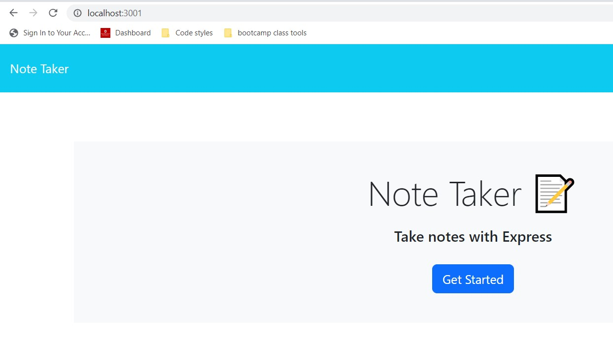
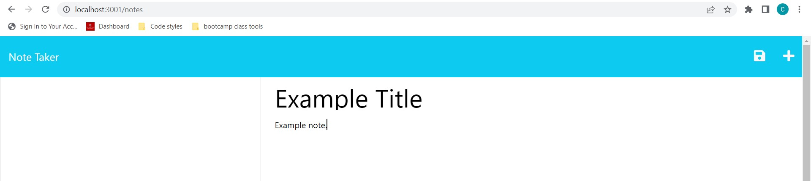

# Express-Take-Note

## Description

This project is a Node.js application that uses the Express framework for routing and db.json for data storage. Users can create and access their memos in a web browser to keep track of tasks and delete them as needed.

## Table of Contents (Optional)

- [Installation](#installation)
- [Usage](#usage)
- [License](#license)

## Installation

This project will be available on <heroku.com> in the future. To explore the note taking application please install Node.js and clone this repository. Run npm install in an integrated terminal, then connect to localhost with the following command: node server.

## Usage

This website is under construction checkout <https://dazzling-cuyahoga-valley-39210-aa18149c4874.herokuapp.com/>
I have added some images to show what will appear in the localhost browser window.

## License

MIT License

Copyright (c) [2023] [Catherine Sinkowski]

Permission is hereby granted, free of charge, to any person obtaining a copy
of this software and associated documentation files (the "Software"), to deal
in the Software without restriction, including without limitation the rights
to use, copy, modify, merge, publish, distribute, sublicense, and/or sell
copies of the Software, and to permit persons to whom the Software is
furnished to do so, subject to the following conditions:

The above copyright notice and this permission notice shall be included in all
copies or substantial portions of the Software.

THE SOFTWARE IS PROVIDED "AS IS", WITHOUT WARRANTY OF ANY KIND, EXPRESS OR
IMPLIED, INCLUDING BUT NOT LIMITED TO THE WARRANTIES OF MERCHANTABILITY,
FITNESS FOR A PARTICULAR PURPOSE AND NONINFRINGEMENT. IN NO EVENT SHALL THE
AUTHORS OR COPYRIGHT HOLDERS BE LIABLE FOR ANY CLAIM, DAMAGES OR OTHER
LIABILITY, WHETHER IN AN ACTION OF CONTRACT, TORT OR OTHERWISE, ARISING FROM,
OUT OF OR IN CONNECTION WITH THE SOFTWARE OR THE USE OR OTHER DEALINGS IN THE
SOFTWARE.
